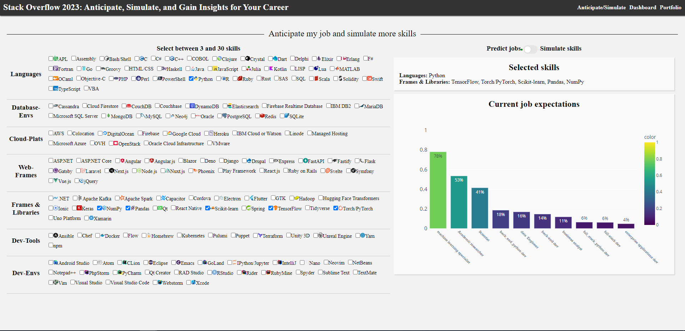
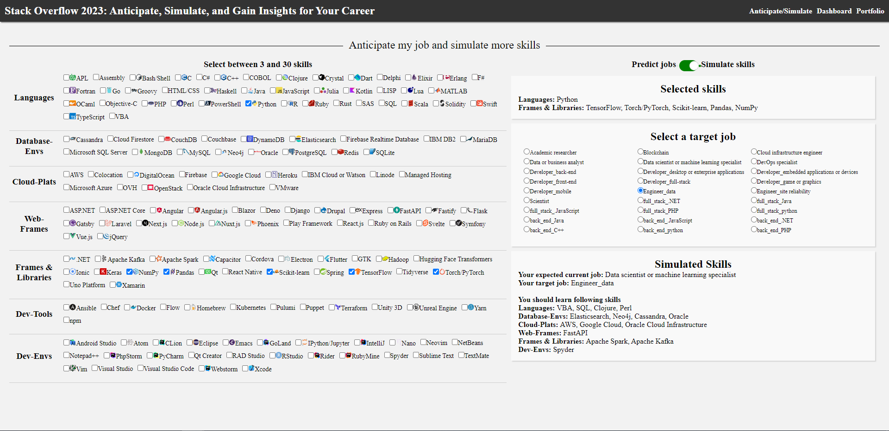
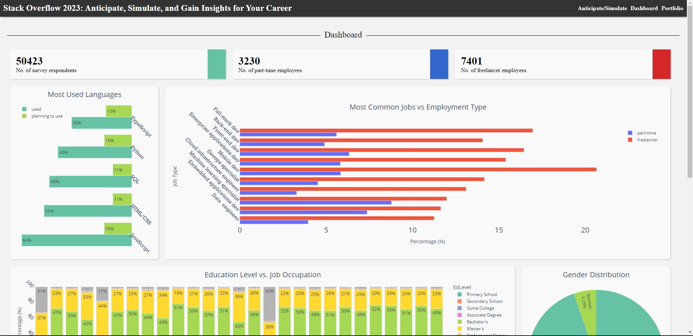
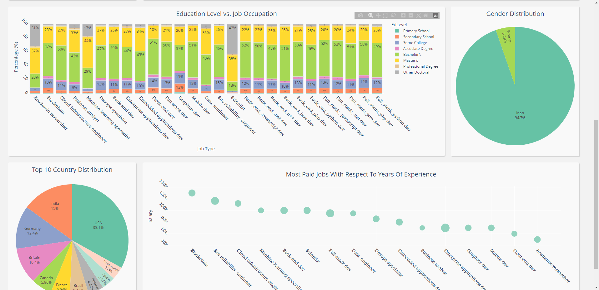

# Career Transition and Skill Enhancement
StackOverflow 2023: Anticipate, Simulate, and Gain Insights for Your Career

## Overview

This project aims to provide valuable insights and tools based on the StackOverflow Survey results of 2023. It offers three main features:

1. **Anticipate Jobs:** Anticipate potential job roles based on your chosen skills.
2. **Simulate Skills:** Simulate and explore additional skills based on your existing ones.
3. **Dashboard Insights:** Visualize and explore insights about skills and job roles.


## Demo

https://career-transition.onrender.com/

## Getting Started

To run this project locally, follow these steps:

1. Clone this repository to your local machine.

   ```bash
   git clone https://github.com/mahmoud-elgarnosy/Dev_skills_recommendations-anlytics.git
   cd Dev_skills_recommendations-anlytics

2. Install the required dependencies.

   1. create and activate virtual env

   ```
   python3 -m venv career && source career/bin/activate
   ```

   2. install requirements
   ```
   pip install --upgrade pip && pip install -r requirements.txt
   
3. Run the Dash web application.
    ```bash
    python -m src.app
    ```
   
4. Open your web browser and navigate to http://localhost:8050/ to access the application.

## Features
- Anticipate Jobs: Provide your skills and get job role predictions.
- Simulate Skills: Discover additional skills based on your selections.
- Dashboard Insights: Explore data-driven insights about skills and job roles. 

## Usage
1. If you anticipate / predict your current jobs: choose your skills and let the model anticipate your current job  

2. Now the time to develop yourself to gain more skills in your current job, or you need to shift your career let the model simulate skills related to the target career

3. insightful dashboard that supports decision-making in your career transition by showcasing career growth
trends, compensation insights, and educational background preferences for specific jobs




## Technologies Used
- [Dash by Plotly](https://dash.plotly.com/): Used for building the web application.
- [Plotly ](https://plotly.com/): Used for creating interactive visualizations.
- [Dash DAQ](https://dash.plotly.com/dash-daq): Integrated for user interface components.
- [Dash Iconify](https://icon-sets.iconify.design/?query=python): For adding icons to the UI.

## Contributing
- Contributions are welcome! Feel free to open issues or pull requests to enhance this project. For major changes, please open an issue first to discuss the proposed changes.

## License
- This project is licensed under the MIT License - see the LICENSE file for details.

## Acknowledgments
- Thanks to the StackOverflow community for their valuable survey data.
- Special thanks to the open-source Dash and Plotly communities for their powerful tools.
- Inspired by a passion for data-driven career decisions.